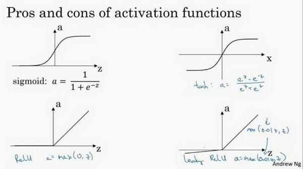
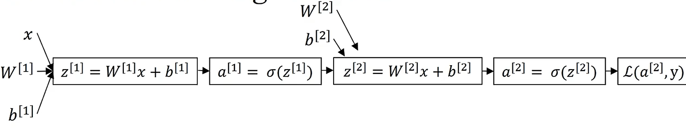

# 第二周 神经网络的编程基础

## 2.1 二分类(Binary Classification)

逻辑回归是一个用于二分类(binary classification)的算法。在二分类问题中，我们 的目标就是习得一个分类器，它以特征向量作为输入，然后预测输出结果 𝑦为 1还是 0

**符号定义**

$x$：表示一个$n_x$维数据，为输入数据，维度为$(n_x,1)$； 

$y$：表示输出结果，取值为$(0,1)$；

$(x^{(i)},y^{(i)})$：表示第$i$组数据，可能是训练数据，也可能是测试数据，此处默认为训练数据； 

$X=[x^{(1)},x^{(2)},...,x^{(m)}]$：表示所有的训练数据集的输入值，放在一个 $n_x×m$的矩阵中，其中$m$表示样本数目; 

- 数据也可以按行，但实现神经网络时，这种形式更简单

$Y=[y^{(1)},y^{(2)},...,y^{(m)}]$：对应表示所有训练数据集的输出值，维度为$1×m$。

用一对$(x,y)$来表示一个单独的样本，$x$代表$n_x$维的特征向量，$y$ 表示标签(输出结果)只能为0或1。

训练集将由$m$个训练样本组成，有时候为了强调这是训练样本的个数，会写作$M_{train}$，当涉及到测试集的时候，我们会使用$M_{test}$来表示测试集的样本数


## 2.2 逻辑回归(Logistic Regression)

给定了输入特征$X$，$\hat{y}$ 表示 $y$ 等于1的一种可能性或者是机会，一种线性关系是$\hat{y}={{w}^{T}}x+b$。

这对于二元分类问题来讲不是一个非常好的算法，因为想让$\hat{y}$表示实际值$y$等于1的机率的话，$\hat{y}$ 应该在0到1之间。因此在逻辑回归中，我们的输出应该是$\hat{y}$等于由上面得到的线性函数式子作为自变量的**sigmoid**函数中: $y=\sigma(w^Tx+b)$

关于**sigmoid**函数的公式是这样的，$\sigma \left( z \right)=\frac{1}{1+{{e}^{-z}}}$,在这里$z$是一个实数


在符号上要注意的一点是当我们对神经网络进行编程时经常会让参数$w$和参数$b$分开，在这里参数$b$对应的是一种偏置。


## 2.3 逻辑回归的代价函数（Logistic Regression Cost Function）

平方误差对于逻辑回归不好用，因为当我们在学习逻辑回归参数的时候，会发现我们的优化目标不是凸优化，只能找到多个局部最优值，梯度下降法很可能找不到全局最优值

在逻辑回归中用到的损失函数是：$L\left( \hat{y},y \right)=-y\log(\hat{y})-(1-y)\log (1-\hat{y})$

- 当$y=1$时损失函数$L=-\log (\hat{y})$，如果想要损失函数$L$尽可能得小，那么$\hat{y}$就要尽可能大，因为**sigmoid**函数取值$[0,1]$，所以$\hat{y}$会无限接近于1。
- 当$y=0$时损失函数$L=-\log (1-\hat{y})$，如果想要损失函数$L$尽可能得小，那么$\hat{y}$就要尽可能小，因为**sigmoid**函数取值$[0,1]$，所以$\hat{y}$会无限接近于0。

损失函数是在**单个训练样本**中定义的，它衡量的是算法在单个训练样本中表现如何，为了衡量算法在全部训练样本上的表现如何，我们需要定义一个算法的**代价函数**，算法的代价函数是对$m$个样本的损失函数求和然后除以$m$:

$J\left( w,b \right)=\frac{1}{m}\sum\limits_{i=1}^{m}{L\left( {{{\hat{y}}}^{(i)}},{{y}^{(i)}} \right)}=\frac{1}{m}\sum\limits_{i=1}^{m}{\left( -{{y}^{(i)}}\log {{{\hat{y}}}^{(i)}}-(1-{{y}^{(i)}})\log (1-{{{\hat{y}}}^{(i)}}) \right)}$


## 2.4 梯度下降法（Gradient Descent）

在测试集上，通过最小化代价函数（成本函数）$J(w,b)$来训练的参数$w$和$b$

代价函数（成本函数）$J(w,b)$是一个凸函数(**convex function**)，有全局最优解

- 

**1.初始化**

对于逻辑回归来说，几乎任意的初始化方法都有效：因为代价函数是凸函数，所以最终都应该到达或接近全局最优点

- 通常用0初始化

**2.朝最陡（梯度下降最快）的方向前进一步**

**3.直到走到全局最优解或者接近全局最优解的地方**

**只有一个参数**
$$
Repeat\ w := w - \alpha \frac{dJ(w)}{dw}
$$

- 其中 $\alpha$ 为学习率，用来控制步长

**有两个参数**
$$
Repeat\ w := w - \alpha\frac{\partial J(w,b)}{\partial w}, b:= b-\alpha \frac{\partial J(w,b)}{\partial b}
$$

- 求偏导


## 2.5 导数（Derivatives）

## 2.6 更多导数的例子

## 2.7 计算图（Computation Graph）

可以说，一个神经网络的计算，都是按照前向或反向传播过程组织的。首先我们计算出一个新的网络的输出（前向过程），紧接着进行一个反向传输操作。后者我们用来计算出对应的梯度或导数。

**一个简化的例子**


## 2.8 使用计算图求导数


$\frac{dJ}{du}=\frac{dJ}{dv}\frac{dv}{du}$ ， $\frac{dJ}{db}=\frac{dJ}{du}\frac{du}{db}$ ，$\frac{dJ}{da}=\frac{dJ}{du}\frac{du}{da}$

在反向传播算法中的术语，我们看到，如果你想计算最后输出变量的导数，使用你最关心的变量对$v$的导数，那么我们就做完了一步反向传播，在这个流程图中是一个反向步骤。


## 2.9 逻辑回归中的梯度下降

假设样本只有两个特征${{x}_{1}}$和${{x}_{2}}$，为了计算$z$，我们需要输入参数${{w}_{1}}$、${{w}_{2}}$ 和$b$，除此之外还有特征值${{x}_{1}}$和${{x}_{2}}$。因此$z$的计算公式为：
$$
z={{w}_{1}}{{x}_{1}}+{{w}_{2}}{{x}_{2}}+b
$$

回想一下逻辑回归的公式定义如下：
$$
\hat{y}=a=\sigma (z)\\
z={{w}^{T}}x+b \\
\sigma \left( z \right)=\frac{1}{1+{{e}^{-z}}}
$$

损失函数：
$$
L( {{{\hat{y}}}^{(i)}},{{y}^{(i)}})=-{{y}^{(i)}}\log {{\hat{y}}^{(i)}}-(1-{{y}^{(i)}})\log (1-{{\hat{y}}^{(i)}})
$$
代价函数：
$$
J\left( w,b \right)=\frac{1}{m}\sum\nolimits_{i}^{m}{L( {{{\hat{y}}}^{(i)}},{{y}^{(i)}})}
$$
假设现在只考虑单个样本的情况，单个样本的代价函数定义如下：
$$
L(a,y)=-(y\log (a)+(1-y)\log (1-a))
$$
其中$a$是逻辑回归的输出，$y$是样本的标签值。现在让我们画出表示这个计算的计算图。

$w$和$b$的修正量可以表达如下：
$$
w:=w-\alpha \frac{\partial J(w,b)}{\partial w}\\
b:=b-\alpha\frac{\partial J(w,b)}{\partial b}
$$


- $\frac{dL(a,y)}{da}=-\frac{y}{a}+\frac{1-y}{1-a}$
- $\frac{da}{dz}=a*(1-a)=>\frac{dL}{dz}=a-y$
- $\frac{dL}{dw_1}=x_1*\frac{dL}{dz},\frac{dL}{dw_2}=x_2*\frac{dL}{dz},\frac{dL}{db}=\frac{dL}{dz}$


## 2.10 m个样本的梯度下降

$$
\frac{\partial J}{\partial w_i} = \frac{1}{m}\sum_{j=1}^{m}\frac{\partial L(a^{(j)}, y^{(j)})}{\partial w_i}
$$

```
J=0;dw1=0;dw2=0;db=0;
for i = 1 to m
    z(i) = w^T * x(i)+b;
    a(i) = sigmoid(z(i));
    J += -[y(i)log(a(i))+(1-y(i))log(1-a(i));
    dz(i) = a(i)-y(i);
    dw1 += x1(i)dz(i);
    dw2 += x2(i)dz(i);
    db += dz(i);
J/= m;
dw1/= m;
dw2/= m;
db/= m;
w=w-alpha*dw
b=b-alpha*db
```

## 2.11 向量化(Vectorization)

```python
import numpy as np #导入numpy库
a = np.array([1,2,3,4]) #创建一个数据a
print(a)
print(a.shape)
# [1 2 3 4]

import time #导入时间库
a = np.random.rand(1000000) # （1000000,）的一维数组
print(a.shape)
b = np.random.rand(1000000) #通过round随机得到两个一百万维度的数组
tic = time.time() #现在测量一下当前时间

#向量化的版本
c = np.dot(a,b) # 通过np.dot函数计算两个向量的点积
print(c.shape)
toc = time.time()
print("Vectorized version:" + str(1000*(toc-tic)) +"ms") #打印一下向量化的版本的时间

#继续增加非向量化的版本
c = 0
tic = time.time()
for i in range(1000000):
    c += a[i]*b[i]
toc = time.time()
print("For loop:" + str(1000*(toc-tic)) + "ms")#打印for循环的版本的时间
```

## 2.12 向量化的更多例子


## 2.13 向量化逻辑回归

```python
Z = w.T @ X + b 
# X: [n_x, m]
# x: [n_x, 1]
# b: [1]
# Z: [1, m]
```

## 2.14 向量化逻辑回归的梯度输出

$Z = w^{T}X + b = np.dot( w.T,X)+b$

$A = \sigma( Z )$

$dZ = A - Y$

${{dw} = \frac{1}{m}*X*dz^{T}\ }$

$db= \frac{1}{m}*np.sum( dZ)$

$w: = w - a*dw$

$b: = b - a*db$

## 2.15 广播

```python
A = np.array([[56.0, 0.0, 4.4, 68.0],
              [1.2, 104.0, 52.0, 8.0],
              [1.8, 135.0, 99.0, 0.9]]) #创建一个3*4的矩阵

cal = A.sum(axis = 0) # 按行合并，即按列求和，得到 1*4 的矩阵
percentage = 100 * A / (cal.reshape(1, 4))
```

- 从技术上来说，不需要 reshape，上一步得到的就是 1 * 4 的矩阵，但在实际编程中，加上reshape能够确保得到需要的矩阵形状

广播的核心规则是：**从右向左**比较两个数组的形状，只要满足以下条件之一，就可以进行广播，广播会在缺失维度和轴长度为1的维度上进行：

1. 两个数组在某个维度上的大小相等。
2. 其中一个数组的某个维度大小为 `1`，可以扩展为与另一个数组该维度的大小一致。

如果以上条件都不满足，NumPy 将抛出 `ValueError`。

“**从右向左**” 是指在 NumPy 广播机制中，**比较数组形状时从最后一个维度（即最右边的维度）开始依次往前对比**。这是为了从更内层的维度到更外层的维度逐步扩展，使广播操作更灵活。


## 2.16 python中的向量

尽量不要使用一维向量(5,)这类的，这会使代码变得难以调试

如果我完全确定一个向量的维度(**dimension**)，扔进一个断言语句(**assertion statement**)。

- ```python
  assert(a.shape == (5,1))
  ```

多使用reshape，这个操作是O(1)的，所以几乎没有性能损耗

## 2.18 逻辑回归损失函数的解释

约定 $\hat{y}=p(y=1|x)$ ，即算法的输出$\hat{y}$ 是给定训练样本 $x$ 条件下 $y$ 等于1的概率。

由此可知
$$
if\ y=1:\ p(y|x)=\hat{y}\\
if\ y=0:\ p(y|x)=1-\hat{y}
$$
由于讨论的是二分类问题的损失函数，因此，$y$的取值只能是0或者1。上述的两个条件概率公式可以合并成如下公式：

$$
p(y|x)={\hat{y}}^{y}{(1-\hat{y})}^{(1-y)}
$$
因为 log 是单调递增的函数，所以最大化 $log(p(y|x))$ 等价于最大化 $p(y|x)$

因此得到损失函数
$$
-L\left( \hat{y},y \right)=y\log(\hat{y})+(1-y)\log (1-\hat{y})
$$

- 之所以在训练时，损失函数取上述式子的负数，是因为训练学习算法时需要算法输出值的概率是最大的（以最大的概率预测这个值），然而在逻辑回归中我们需要最小化损失函数

**m个样本的代价函数**

假设所有的训练样本服从同一分布且相互独立，也即独立同分布的，所有这些样本的联合概率就是每个样本概率的乘积:

$$
P\left(\text{labels  in training set} \right) = \prod_{i =1}^{m}{P(y^{(i)}|x^{(i)})}
$$
做最大似然估计，需要寻找一组参数，使得给定样本的观测值概率最大，令这个概率最大化等价于令其对数最大化，在等式两边取对数：

$$
logp\left( \text{labels  in  training set} \right) = log\prod_{i =1}^{m}{P(y^{(i)}|x^{(i)})} = \sum_{i = 1}^{m}{logP(y^{(i)}|x^{(i)})} = \sum_{i =1}^{m}{- L(\hat y^{(i)},y^{(i)})}
$$
推导出了前面给出的**logistic**回归的成本函数$J(w,b)= \sum_{i = 1}^{m}{L(\hat y^{(i)},y^{\hat( i)})}$，要求其最小化


# 第三周 神经网络

## 3.1 神经网络概览


使用符号$^{[m]}$表示第$m$层网络中节点相关的数，这些节点的集合被称为第$m$层网络。这样可以保证$^{[m]}$不会和我们之前用来表示单个的训练样本的$^{(i)}$(即我们使用表示第$i$个训练样本)混淆；
整个计算过程，公式如下:
$$
\left.
	\begin{array}{r}
	{x }\\
	{W^{[1]}}\\
	{b^{[1]}}
	\end{array}
	\right\}
	\implies{z^{[1]}=W^{[1]}x+b^{[1]}}
	\implies{a^{[1]} = \sigma(z^{[1]})}
$$

$$
\left.
	\begin{array}{r}
	\text{$a^{[1]} = \sigma(z^{[1]})$}\\
	\text{$W^{[2]}$}\\
	\text{$b^{[2]}$}\\
	\end{array}
	\right\}
	\implies{z^{[2]}=W^{[2]}a^{[1]}+b^{[2]}}
	\implies{a^{[2]} = \sigma(z^{[2]})}\\ 
	\implies{{L}\left(a^{[2]},y \right)}
$$

**反向传播**
$$
\left.
	\begin{array}{r}
	{da^{[1]} = {d}\sigma(z^{[1]})}\\
	{dW^{[2]}}\\
	{db^{[2]}}\\
	\end{array}
	\right\}
	\impliedby{{dz}^{[2]}={d}(W^{[2]}\alpha^{[1]}+b^{[2]}})
	\impliedby{{{da}^{[2]}} = {d}\sigma(z^{[2]})}\\
	\impliedby{{dL}\left(a^{[2]},y \right)}
$$


## 3.2 神经网络的表示

术语隐藏层的含义是在训练集中，这些中间结点的准确值我们是不知道到的，也就是说你看不见它们在训练集中应具有的值。

记号$a^{[0]}$可以用来表示输入特征。$a$表示激活的意思，它意味着网络中不同层的值会传递到它们后面的层中，输入层将$x$传递给隐藏层，所以我们将输入层的激活值称为$a^{[0]}$；下一层即隐藏层也同样会产生一些激活值，那么我将其记作$a^{[1]}$，所以具体地，这里的第一个单元或结点我们将其表示为$a^{[1]}_{1}$，第二个结点的值我们记为$a^{[1]}_{2}$，依此类推

最后输出层将产生某个数值$a$，它只是一个单独的实数，所以的$\hat{y}$值将取为$a^{[2]}$。

在约定俗成的符号传统中，在这里你所看到的这个例子，只能叫做一个两层的神经网络。原因是当我们计算网络的层数时，输入层是不算入总层数内，所以隐藏层是第一层，输出层是第二层。第二个惯例是我们将输入层称为第零层，所以在技术上，这仍然是一个三层的神经网络，因为这里有输入层、隐藏层，还有输出层。但是在传统的符号使用中，如果你阅读研究论文或者在这门课中，你会看到人们将这个神经网络称为一个两层的神经网络，因为我们不将输入层看作一个标准的层。


## 3.3 计算神经网络的输出


$$
a^{[1]} =
	\left[
		\begin{array}{c}
		a^{[1]}_{1}\\
		a^{[1]}_{2}\\
		a^{[1]}_{3}\\
		a^{[1]}_{4}
		\end{array}
		\right]
		= \sigma(z^{[1]})
$$

$$
\left[
		\begin{array}{c}
		z^{[1]}_{1}\\
		z^{[1]}_{2}\\
		z^{[1]}_{3}\\
		z^{[1]}_{4}\\
		\end{array}
		\right]
		 =
	\overbrace{
	\left[
		\begin{array}{c}
		...W^{[1]T}_{1}...\\
		...W^{[1]T}_{2}...\\
		...W^{[1]T}_{3}...\\
		...W^{[1]T}_{4}...
		\end{array}
		\right]
		}^{W^{[1]}}
		*
	\overbrace{
	\left[
		\begin{array}{c}
		x_1\\
		x_2\\
		x_3\\
		\end{array}
		\right]
		}^{input}
		+
	\overbrace{
	\left[
		\begin{array}{c}
		b^{[1]}_1\\
		b^{[1]}_2\\
		b^{[1]}_3\\
		b^{[1]}_4\\
		\end{array}
		\right]
		}^{b^{[1]}}
$$

 


## 3.4 多个样本的向量化

$$
x =
	\left[
		\begin{array}{c}
		\vdots & \vdots & \vdots & \vdots\\
		x^{(1)} & x^{(2)} & \cdots & x^{(m)}\\
		\vdots & \vdots & \vdots & \vdots\\
		\end{array}
		\right]
$$


$$
W^{[1]}=
	\left[
		\begin{array}{c}
		...W^{[1]T}_{1}...\\
		...W^{[1]T}_{2}...\\
		...W^{[1]T}_{3}...\\
		...W^{[1]T}_{4}...
		\end{array}
		\right]
$$

$$
Z^{[1]} =
	\left[
		\begin{array}{c}
		\vdots & \vdots & \vdots & \vdots\\
		z^{[1](1)} & z^{[1](2)} & \cdots & z^{[1](m)}\\
		\vdots & \vdots & \vdots & \vdots\\
		\end{array}
		\right]
$$

$$
A^{[1]} =
	\left[
		\begin{array}{c}
		\vdots & \vdots & \vdots & \vdots\\
		\alpha^{[1](1)} & \alpha^{[1](2)} & \cdots & \alpha^{[1](m)}\\
		\vdots & \vdots & \vdots & \vdots\\
		\end{array}
		\right]
$$

$$
\left.
		\begin{array}{r}
		\text{$z^{[1](i)} = W^{[1](i)}x^{(i)} + b^{[1]}$}\\
		\text{$\alpha^{[1](i)} = \sigma(z^{[1](i)})$}\\
		\text{$z^{[2](i)} = W^{[2](i)}\alpha^{[1](i)} + b^{[2]}$}\\
		\text{$\alpha^{[2](i)} = \sigma(z^{[2](i)})$}\\
		\end{array}
		\right\}
		\implies
		\begin{cases}
		\text{$Z^{[1]}=W^{[1]}X+b^{[1]}$}\\
		\text{$A^{[1]} = \sigma(z^{[1]})$}\\
		\text{$z^{[2]} = W^{[2]}A^{[1]} + b^{[2]}$}\\ 
		\text{$A^{[2]} = \sigma(z^{[2]})$}\\ 
		\end{cases}
$$

## 3.5 向量化实现的解释

## 3.6 激活函数

使用一个神经网络时，需要决定使用哪种激活函数用隐藏层上，哪种用在输出节点上。到目前为止，之前的视频只用过**sigmoid**激活函数，但是，有时其他的激活函数效果会更好。



**tanh**函数

- $a= tanh(z) = \frac{e^{z} - e^{- z}}{e^{z} + e^{- z}}$
- $a = tan(z)$​的值域是位于+1和-1之间
- 事实上，**tanh**函数是**sigmoid**的向下平移和伸缩后的结果。对它进行了变形后，穿过了$(0,0)$点，并且值域介于+1和-1之间。

结果表明，如果在隐藏层上使用函数**tanh**，效果总是优于**sigmoid**函数。因为函数值域在-1和+1的激活函数，其均值是更接近零均值的。

- 在训练一个算法模型时，如果使用**tanh**函数代替**sigmoid**函数中心化数据，使得数据的平均值更接近0而不是0.5。这会使下一层学习简单一点，在第二门课中会详细讲解。
- 有一个例外：在二分类的问题中，对于输出层，因为$y$的值是0或1，所以想让$\hat{y}$的数值介于0和1之间，而不是在-1和+1之间。所以需要使用**sigmoid**激活函数。

**sigmoid**函数和**tanh**函数两者共同的缺点是，在$z$特别大或者特别小的情况下，导数的梯度或者函数的斜率会变得特别小，最后就会接近于0，导致降低梯度下降的速度。

**ReLU**

- $ a =max( 0,z) $
- 只要$z$是正值的情况下，导数恒等于1，当$z$​是负值的时候，导数恒等于0。
- 从实际上来说，当使用$z$的导数时，$z$=0的导数是没有定义的。但是当编程实现的时候，这个值相当小，所以，在实践中，不需要担心这个值，$z$是等于0的时候，假设一个导数是1或者0效果都可以。

**激活函数选择的经验法则**

- 如果输出是0、1值（二分类问题），则输出层选择**sigmoid**函数，然后其它的所有单元都选择**Relu**函数。
  - 这是很多激活函数的默认选择，如果在隐藏层上不确定使用哪个激活函数，那么通常会使用**Relu**激活函数。有时，也会使用**tanh**激活函数，但**Relu**的一个优点是：当$z$是负值的时候，导数等于0。
- 也有另一个版本的**Relu**被称为**Leaky Relu**。
  - $a = max( 0.01z,z)$
  - 当$z$是负值时，这个函数的值不是等于0，而是轻微的倾斜
  - 这个函数通常比**Relu**激活函数效果要好，尽管在实际中**Leaky ReLu**使用的并不多。

两者的优点是：

1. 计算导数时，只需要**if-else**即可，而**sigmoid**和**tanh**需要浮点运算
2. **sigmoid**和**tanh**函数的导数在正负饱和区的梯度都会接近于0，这会造成梯度弥散，而**Relu**和**Leaky ReLu**函数大于0部分都为常数，不会产生梯度弥散现象。
   - (同时应该注意到的是，**Relu**进入负半区的时候，梯度为0，神经元此时不会训练，产生所谓的稀疏性，而**Leaky ReLu**不会有这问题)
   - $z$在**ReLu**的梯度一半都是0，但是，有足够的隐藏层使得z值大于0，所以对大多数的训练数据来说学习过程仍然可以很快。

## 3.7 为什么需要非线性激活函数

事实证明，如果你使用线性激活函数或者没有使用一个激活函数，那么无论你的神经网络有多少层一直在做的只是计算线性函数，所以不如直接去掉全部隐藏层。

线性隐层一点用也没有，因为这两个线性函数的组合本身就是线性函数，所以除非你引入非线性，否则你无法计算更有趣的函数，即使你的网络层数再多也不行

总而言之，不能在隐藏层用线性激活函数，可以用**ReLU**或者**tanh**或者**leaky ReLU**或者其他的非线性激活函数，唯一可以用线性激活函数的通常就是输出层

- 除了这种情况，会在隐层用线性函数的，除了一些特殊情况，比如与压缩有关的

## 3.8 激活函数的导数

**sigmoid**

$\frac{d}{dz}g(z) = {\frac{1}{1 + e^{-z}} (1-\frac{1}{1 + e^{-z}})}=g(z)(1-g(z))$

**tanh**

$\frac{d}{{d}z}g(z) = 1 - (tanh(z))^{2}$

**ReLU**
$$
g(z)^{'}=
  \begin{cases}
  0&	\text{if z < 0}\\
  1&	\text{if z > 0}\\
undefined&	\text{if z = 0}
\end{cases}
$$

- 注：通常在$z$= 0的时候给定其导数1,0；当然$z$=0的情况很少


## 3.9 神经网络的梯度下降

单隐层神经网络会有$W^{[1]}$，$b^{[1]}$，$W^{[2]}$，$b^{[2]}$这些参数，还有个$n^{[0]}$表示输入特征的个数，$n^{[1]}$表示隐藏单元个数，$n^{[2]}$表示输出单元个数。

- 矩阵$W^{[1]}$的维度就是($n^{[1]}, n^{[0]}$)，$b^{[1]}$就是$n^{[1]}$维向量，可以写成$(n^{[1]}, 1)$，就是一个的列向量。
- 矩阵$W^{[2]}$的维度就是($n^{[2]}, n^{[1]}$)，$b^{[2]}$的维度就是$(n^{[2]},1)$维度。

假设你在做二分类任务，那么你的成本函数等于：
$$
J(W^{[1]},b^{[1]},W^{[2]},b^{[2]}) = {\frac{1}{m}}\sum_{i=1}^mL(\hat{y}, y)
$$
**loss function**和之前做**logistic**回归完全一样。

**forward propagation**：
(1)
$Z^{[1]} = W^{[1]}X + b^{[1]}\quad(n^{[1]},m)$
(2)
$A^{[1]} = g^{[1]}(Z^{[1]})\quad(n^{[1]},m)$
(3)
$Z^{[2]} = W^{[2]}A^{[1]} + b^{[2]}\quad(n^{[2]},m)$
(4)
$A^{[2]} = g^{[2]}(Z^{[2]}) = \sigma(Z^{[2]})\quad(n^{[2]},m)$

**back propagation**：
$ dZ^{[2]} = A^{[2]} - Y , Y = \begin{bmatrix}y^{[1]} & y^{[2]} & \cdots & y^{[m]}\\ \end{bmatrix} $
$ dW^{[2]} = {\frac{1}{m}}dZ^{[2]}A^{[1]T} $
$ {\rm d}b^{[2]} = {\frac{1}{m}}np.sum({d}Z^{[2]},axis=1,keepdims=True)$
$ dZ^{[1]} = \underbrace{W^{[2]T}{\rm d}Z^{[2]}}_{(n^{[1]},m)}\quad*\underbrace{{g^{[1]}}^{'}(Z^{[1]})}_{(n^{[1]},m)} $
$dW^{[1]} = {\frac{1}{m}}dZ^{[1]}X^{T}$
${\underbrace{db^{[1]}}_{(n^{[1]},1)}} = {\frac{1}{m}}np.sum(dZ^{[1]},axis=1,keepdims=True)$

## 3.10 直观理解反向传播




## 3.11 随机初始化

W都初始化为0会使得不同的神经元实际上给出同样的输出（完全对称），可以通过归纳法证明每次迭代后，结果都是对称的，多个单元没有任何意义

- 只要W随机初始化了，b可以初始化为0

$W^{[1]} = np.random.randn(2,2)\;*\;0.01\;,\;b^{[1]} = np.zeros((2,1))$
$W^{[2]} = np.random.randn(2,2)\;*\;0.01\;,\;b^{[2]} = 0$

通常倾向于初始化为很小的随机数。因为如果你用**tanh**或者**sigmoid**激活函数，或者说只在输出层有一个**Sigmoid**，如果（数值）波动太大，当你计算激活值时$z^{[1]} = W^{[1]}x + b^{[1]}\;,\;a^{[1]} = \sigma(z^{[1]})=g^{[1]}(z^{[1]})$如果$W$很大，$z$就会很大或者很小，因此这种情况下你很可能停在**tanh**/**sigmoid**函数的平坦的地方(见图3.8.2)，这些地方梯度很小也就意味着梯度下降会很慢，因此学习也就很慢。
